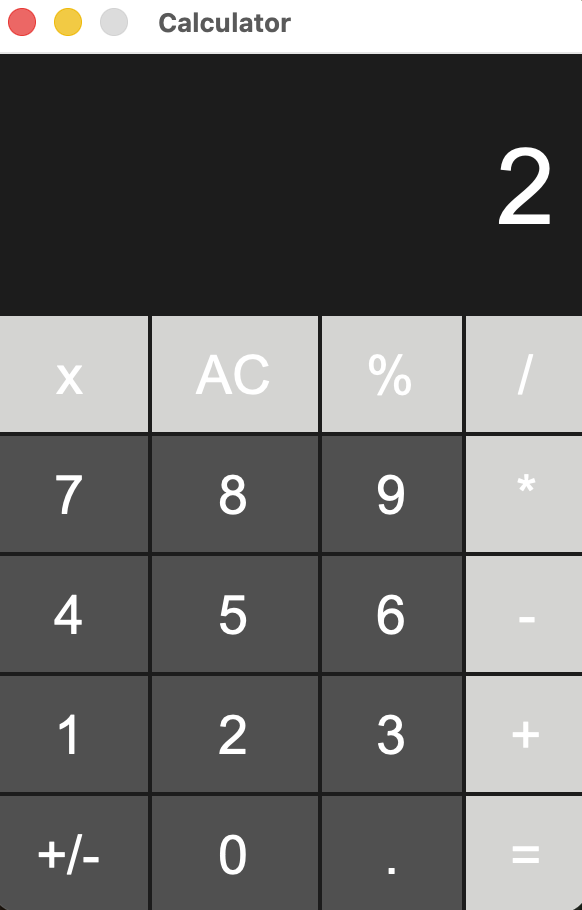

# Calculator

A calculator built with python and tkinter.

* `0-9` Numbers
* `+` Addition
* `−` Subtraction
* `*` Multiplication
* `/` Division
* `%` Percentage
* `.` Decimal numbers
* `+/-` Positive/Negative
* `=` Calculate
* `AC` Clear
* `x` Backspace




## How to run

```python
python calculator.py
```
